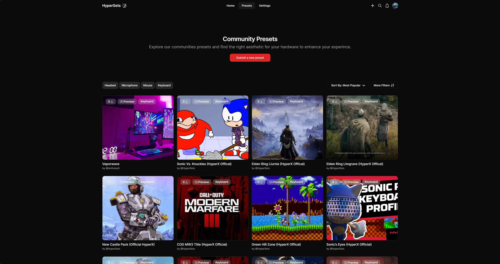
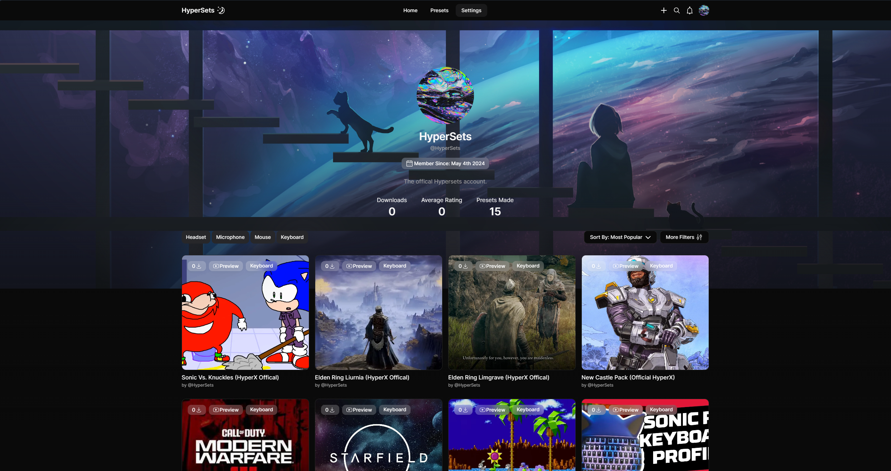
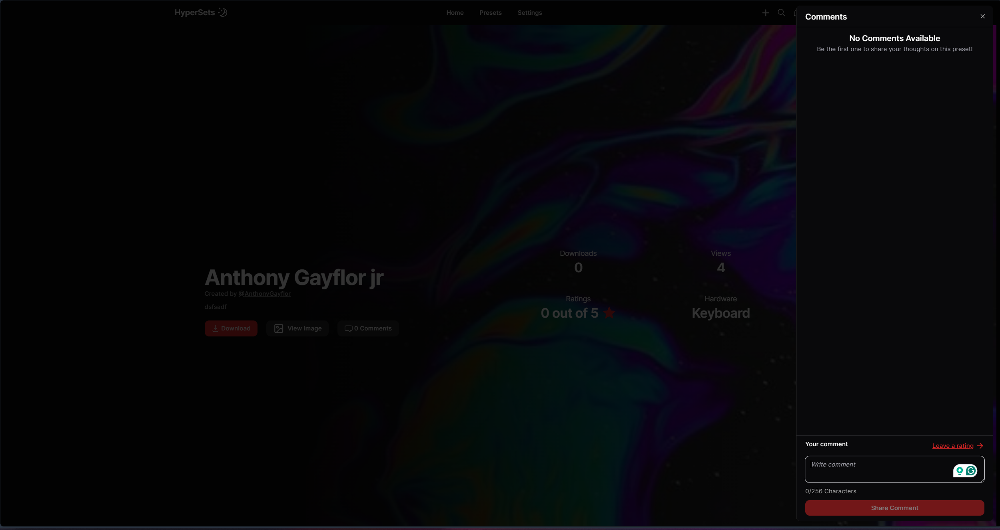

# HyperSets

*HyperSets Homepage - Light Mode*
  
An online platform for the HyperX community to store, discover, and illuminate their pc's peripheral setup.

HyperSets offers a wide array of custom NGenuity profiles for members to enhance their environment through a combination of visual effects for ambient RGB lighting and key binding macros for games or work. Along with a library of 50+ games to choose from that aligns with its aesthetics.

## Live Demo

Publicly being hosted at https://Hyper-Sets.com. 

## Table of Contents
- [HyperSets](#hypersets)
  - [Live Demo](#live-demo)
  - [Table of Contents](#table-of-contents)
  - [Problem to solve](#problem-to-solve)
  - [Motivation](#motivation)
  - [Tech Stack](#tech-stack)
  - [Features](#features)
    - [User Facing](#user-facing)
    - [Technical](#technical)
  - [Screenshots](#screenshots)
  - [License](#license)
  
## Problem to solve

There are talented people creating cool profiles, but dont have a platform to share it on. Unless they are capable of building a website to host their presets; chances are it would get uploaded on a public form like reddit and lost within the sea of content. Thus making it a hassel to explore alternatives outside of what the manufacture provides since alot of custom profiles are scattered on the web.

My theory was if users had a central platform to upload, share, and download custom NGenuity RGB profiles; along with an incentive of getting paid per download of their preset. Not only would this help organize profiles on the web, the number of profiles availables would increase as well.

## Motivation

The primary motivation to build HyperSets were:
- To centralize custom presets available on the web for HyperX.
- Take a chance at building something for cosumers
- Move away from non-relational databases and learn SQL through hypersets
- Build a strong portfolio

## Tech Stack

**UI\UX Design Tool:** Figma

**Programming Language:** TypeScript

**Client:** React, React Hook Form, React Drop Zone, Framer Motion, Next.Js, Zod, lucide-react, TailwindCSS, clsx, AceternityUI, ShadcnUI

**Server:** Node, Supabase, PostgreSQL

**Project Management:** Trello

**Devops:** Vercel

## Features

### User Facing
- Light/dark mode toggle.
- Email and password authentication.
- Forgot password/password resets.
- Open Authentication (OAuth) with providers Google, Discord, and Twitch for both sign up and login.
- Profile page for members to share *all* of their creations via url.
- Settings page for members to tweak their profile, security, and presets info.
- Accessible Multistep form for creating a preset, that is accessible on every page but carefully possitioned to seamless fit within the ui.
- Toast notifications for specific events on client like an invalid login attempt, or successfull upload.
- Realtime notification system for when a member interacts with a preset (like, comment, download).
- Feedback system on all content related to presets via comments, likes, and ratings.
- Preset feed that can be filtered via hardware, game, and effects; as well as sorted by varius paramaters.

### Technical
- Server side rendering.
- SEO.
- Scehma Validation for form submissions.
- User sessions with HTTP only cookies containing refresh and access tokens.
- Cloud storage for uploading images.
- Image optimization via Next.js <Image /> component.
- Search display to find the exact preset you need.
- PostgreSQL RLS policies for added database security.

## Screenshots

*Feed of presets on path /presets*/

*A members profile page and all their presets created*

*Comment sheet for an invidual preset*

*Security settings where members can update their password and other authentication settings*

*Form for creating and uploading a new preset, but in a modal*

*Login page for users to sign in via OAuth providers Discord, Twitch, and Google, or just email and password*
  
## License

Copyright 2024 Anthony Saywala Gayflor

Licensed under the Apache License, Version 2.0 (the "License");
you may not use this file except in compliance with the License.
You may obtain a copy of the License at

    http://www.apache.org/licenses/LICENSE-2.0

Unless required by applicable law or agreed to in writing, software
distributed under the License is distributed on an "AS IS" BASIS,
WITHOUT WARRANTIES OR CONDITIONS OF ANY KIND, either express or implied.
See the License for the specific language governing permissions and
limitations under the License.

